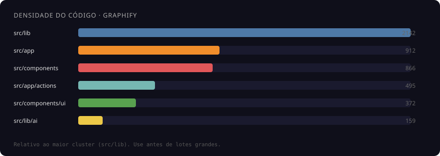

<p align="center">
  <a href="https://w1capital.github.io/LexisPredict/">
    
  </a>
</p>

<p align="center">
  <strong>LexisPredict</strong><br/>
  O gabinete digital de quem vive de <strong>prazo</strong> e <strong>volume</strong>.<br/>
  <em>Não é CRM de vitrine. É o sistema operacional da carteira jurídica.</em>
</p>

<p align="center">
  <a href="https://w1capital.github.io/LexisPredict/">
    
  </a>
  
  
  
  
  
  
</p>

<p align="center">
  <a href="#-por-que-existe">Por que existe</a> ·
  <a href="#-o-que-é">Produto</a> ·
  <a href="#-para-quem">Para quem</a> ·
  <a href="#-web-vs-offline">Web vs Offline</a> ·
  <a href="#-módulos">Módulos</a> ·
  <a href="#-mapa-graphify-ao-vivo">Mapa graphify</a> ·
  <a href="#-planilha--crm">Planilha & CRM</a> ·
  <a href="#-arquitetura">Arquitetura</a> ·
  <a href="#-começar">Começar</a> ·
  <a href="#-licença">Licença</a>
</p>

---

## Mapa graphify ao vivo

<p align="center">
  <a href="https://w1capital.github.io/LexisPredict/">
    
  </a>
</p>

<p align="center">
  <a href="https://w1capital.github.io/LexisPredict/"><strong>⟶ Abrir mapa interativo (4.378 nós · 13.547 arestas · 225 comunidades)</strong></a>
</p>

| Métrica | Valor |
| ------- | ----- |
| **Nós** | 4.378 |
| **Arestas** | 13.547 |
| **Comunidades** | 225 |
| **Arquivo** | `docs/assets/graph.html` |
| **URL ao vivo** | [w1capital.github.io/LexisPredict](https://w1capital.github.io/LexisPredict/) |

### Densidade (onde mexer com cuidado)

| Pasta | ~símbolos | Papel |
| ----- | --------- | ----- |
| `src/lib` | **2.142** | Núcleo de domínio |
| `src/app` | **912** | Rotas Next |
| `src/components` | **866** | UI |
| `src/app/actions` | **495** | Server actions |
| `src/components/ui` | **372** | Design system |
| `src/lib/ai` | **159** | IA / motores |
| `src/lib/data-provider` | **58** | Provider / sync |
| `src/lib/hybrid` | **34** | Hybrid / Sheets (Plano B) |

### Paleta (mesmo visual do grafo)

| | Hex | Leitura |
|--|-----|---------|
| 🔵 | `#4E79A7` | Núcleo / lib |
| 🟠 | `#F28E2B` | App / rotas |
| 🔴 | `#E15759` | Componentes |
| 🩵 | `#76B7B2` | Actions |
| 🟢 | `#59A14F` | UI kit |
| 🟡 | `#EDC948` | IA |
| 🟣 | `#B07AA1` | Data provider |
| 🌸 | `#FF9DA7` | Hybrid |

### Ativar o mapa ao vivo (uma vez)

1. Coloque o HTML do graphify em **`docs/assets/graph.html`**
2. Repo → **Settings → Pages → Source: GitHub Actions**
3. Push do workflow `pages-docs.yml` (já no pacote) + pasta `docs/`
4. URL: `https://w1capital.github.io/LexisPredict/`  
   (se o nome do repo/org for outro, ajuste o link no README)

Local sem Pages:

```bash
npx --yes serve docs -p 5180
# http://localhost:5180/  ou  /assets/graph.html
```

O mapa **não** entra no app Lexis (Vercel) — só documentação.

---

## Por que existe

Assessoria que opera **revisional / volume** não precisa de mais um funil bonito.

| Dor do dia a dia | O que o Lexis faz |
| ---------------- | ----------------- |
| Prazo vencido sem dono claro | Fila + status + responsável |
| “Quem atendeu esse CNJ?” | Ranking por log (`atendido_por`) sem roubar carteira |
| Silêncio no tribunal | Scanner DataJud / DJEN + BA real |
| Planilha paralela bagunçada | Export/import pelo **CRM do próprio app** |
| Queda de internet / nuvem | Offline EXE continua com a carteira local |

> **Uma linha:** organiza e acelera quem já opera processos — não substitui RH, financeiro genérico ou marketing de vitrine.

<p align="center">
  
</p>

```text
  CARTEIRA → FILAS → ATENDIMENTO → TRIBUNAL → GESTÃO
  processos  vencidos  quem atendeu  DataJud   supervisão
             BA real   sem roubar    DJEN      relatório
```

---

## O que é

**LexisPredict (web)** — sistema diário da assessoria: carteira, filas, atendimento, DataJud/DJEN, peças, dossiê, CRM operacional e supervisão.

**LexisPredict Offline** — EXE Windows ([OFFLINE-LEXISPREDICT](https://github.com/W1CAPITAL/OFFLINE-LEXISPREDICT)): login local, planilha/JSON, DataJud/DJEN com internet. Paridade com o web: *em evolução*.

---

## Para quem

| Perfil | Ganha o quê |
| ------ | ----------- |
| **Operador** | Fila do dia, atendimento, WhatsApp, carteira sem ruído |
| **Supervisor** | Empresa inteira, “Rodar empresa”, ranking, auditoria |
| **Sócio / BKO** | Volume, vencidos, silêncio, relatório executivo |
| **Quem vive de planilha** | Excel/Sheets pelo **CRM do Lexis**, não como banco principal |

Não é HubSpot. Não é PJe. É **gabinete + operação**.

---

## Web vs Offline

| | **Web (este repo)** | **Offline EXE** |
|--|--|--|
| Onde roda | Vercel + browser | Windows (`Lexis Gabinete.exe`) |
| Login | Supabase Auth | Login/senha locais |
| Dados primários | Postgres multi-tenant (`empresa_id`) | Planilha / JSON local |
| DataJud + DJEN | Sim | Sim (com internet) |
| CRM / ranking / supervisão | Completo | Em paridade gradual |
| Queda da nuvem | Depende do host | EXE continua |

---

## Módulos

| Módulo | Função |
| ------ | ------ |
| **Painel** | KPIs: ativos, vencidos, atendidos, novidades |
| **Meus processos / Cases** | Carteira por `created_by` |
| **Processos da empresa** | Visão completa · **“Rodar empresa”** só supervisão |
| **Filas / Tarefas** | Prioridade do dia |
| **Parados / Encerrados a revisar** | Silêncio tribunal ≠ prazo vencido |
| **Scanner tribunal** | DataJud + DJEN |
| **WhatsApp / Peças / Dossiê** | Atendimento e documentação |
| **CRM Assessoria** | Clientes, funil — **export/import planilha** |
| **Team / Supervisão** | Ranking, cargos, auditoria |
| **Offline** | `/offline` + EXE irmão |

---

## Planilha & CRM

**Postgres = fonte da verdade.** Planilha = espelho / arquivo de trabalho.

```text
Lexis (web) → Postgres → Export XLSX/CSV → Excel/Sheets
                 ↘ Import pelo CRM ← edição humana
```

Apps Script só como **Plano B** opcional (legado offline). Nunca no caminho feliz do atendimento.

| Objetivo | Preferir |
| -------- | -------- |
| Vender / operar assessoria | Web + Postgres + CRM |
| Trabalhar offline no notebook | EXE + planilha local |
| Espelhar números no Excel | **Export/Import pelo app** |
| Sync automático Sheet ↔ app | Apps Script (opcional) |

---

## Arquitetura

```text
UI (Next.js 15)
  → Server Actions
  → Postgres (Supabase) · empresa_id · created_by · atendido_por
  → DataJud / DJEN / KPIs
  → CRM export/import
  → [opcional] Apps Script ↔ Sheets
```

**Regras de ouro**

- **Dono** = `created_by`
- **Crédito de atendimento** = `atendido_por` / log
- **Atender não troca o dono**
- Ranking da semana = log (`pessoa + CNJ` único)

---

## Notas honestas

| Assunto | Verdade |
| ------- | ------- |
| DataJud | Não é PJe / e-SAJ · consulta pública indexada |
| DJEN | Pode 403 / HTML / rate limit · lote sequencial |
| Heurística de encerramento | Apoio operacional · **não** é certidão |
| IA | Depende de cota / motor configurado |
| Apps Script | Opcional · não escala como SQL |
| Graphify | **Ao vivo no Pages** · não feature do app |

---

## Começar

```bash
git clone https://github.com/W1CAPITAL/LexisPredict.git
cd LexisPredict
npm install
cp .env.example .env.local
npm run dev
```

```bash
npm run typecheck && npm run build
```

**Mapa ao vivo:** [w1capital.github.io/LexisPredict](https://w1capital.github.io/LexisPredict/)  
**Offline:** [OFFLINE-LEXISPREDICT](https://github.com/W1CAPITAL/OFFLINE-LEXISPREDICT)

---

## Roadmap

1. Contagens idênticas em painel, `/processos` e relatório  
2. Offline: paridade de atendimento + export/import estável  
3. Sync web ↔ EXE sem duplicar CNJ  
4. Apps Script apenas adaptador opcional — nunca núcleo  

---

## Diferencial comercial

| | CRM genérico | **LexisPredict** |
|--|--|--|
| Centro | Lead / deal | **Processo · CNJ · prazo** |
| Usuário | Vendas | **Operador, BKO, supervisor jurídico** |
| Rotina | Funil | **Retorno, vencidos, tribunal, ranking** |
| Planilha | Integração genérica | **Export/CRM nativo** |
| Offline | Raro | **EXE Windows real** |
| Código | Caixa-preta | **Graphify ao vivo na doc** |

---

## Licença

Copyright © 2026 **Davi Alves Figueredo** / **W1 Capital Assessoria Financeira Ltda.**

Software **proprietário**. Proibida cópia, redistribuição ou exploração comercial sem autorização escrita.

**Contato:** [w1capitalassessoria@protonmail.com](mailto:w1capitalassessoria@protonmail.com)

---

<p align="center">
  <a href="https://w1capital.github.io/LexisPredict/">🗺️ Abrir mapa graphify ao vivo</a><br/>
  <sub>LexisPredict · W1 Capital · Gabinete digital para quem opera de verdade</sub>
</p>
